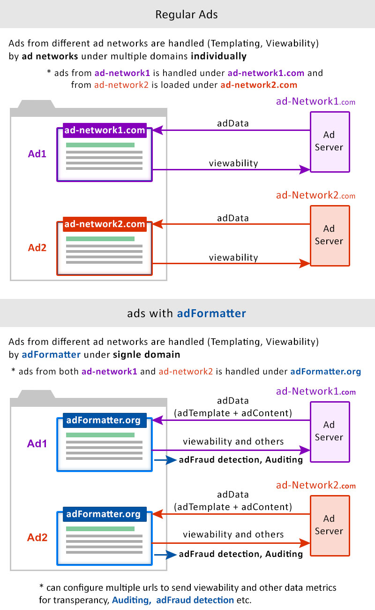
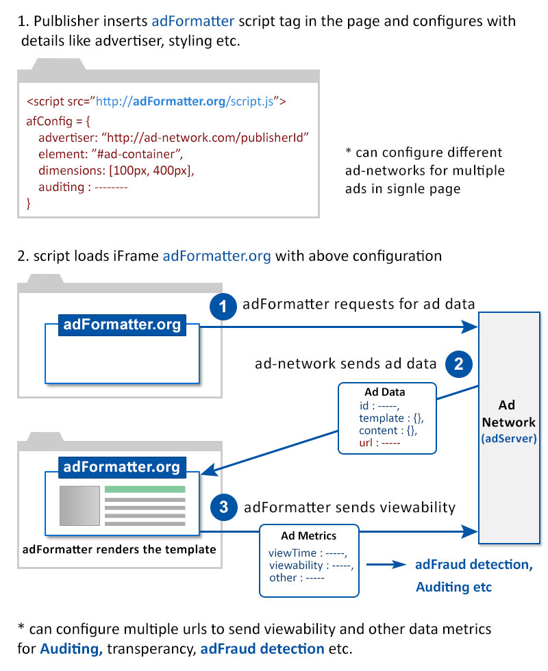
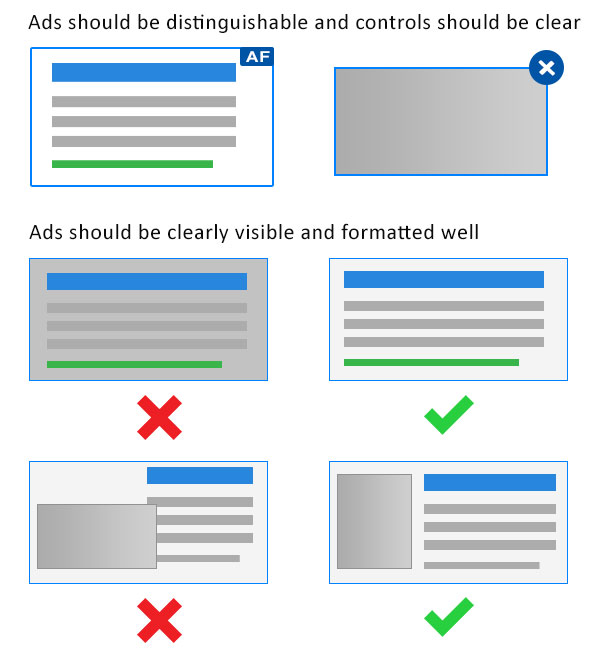

#### adFormatter

Digital Advertising is facing many challenges these days. adBlockers, adFraud, lack of Transperancy, Security, etc., are some of them. adFormatter handles these challenges by maintaining uniform standards, indexes, logs and transperancy. Ad networks send adTemplate, Content, Images and Video related to the ad, then adFormatter takes care of Templating, Viewability, etc under unique domain.

 adFormatter contains ATE (Ad Template Engine) that follows <a href="#formatted_rendering" class="af-imp">Formatted Rendering</a>. It has some predefined customizable ad templates like Text ads, Gallery and Shopping etc.
 
<ul>
  <li>reduces development cost and ad load time</li>
  <li>transperancy in Auditing and easy <a href="#adfraud_detection" class="af-imp">adFraud detection and prevention</a></li>
  <li>provides Security and <a href="#answering_adblockers" class="af-imp">answers Adblockers</a></li>
  <li>allows Micro Payments</li>
  <!-- <li>easy Management</li> -->
</ul>

<h4>Difference between Regular ads and ads with adFormatter</h4>

  
** Ad networks need not required to implement complicated code for Templating and Viewability metrics.
 
** Advertisers know where the ad is served and can easily get ad metrics by configuring Auditing and adFraud detection.
 
** Publishers can collect Micro Payments if user blocks the ad and also get to know what ads are shown on their page.
 
** Publisher is confident that Ad is not slowing down his page, and can *customize the ad.
 
** End users will be sure that ads are Well formatted, Secure and No malware is injected.
  

#### How it works?

  

#### Reducing cost and ad load time:
**adFormatter** caches reusable code in the browser, so no need to download again and again for multiple ads from different ad networks. Only the Content related to the ad will be downloaded, and the code related to ad handling will reside in the browser. 

adNetworks will send the adTemplate and their functionality in declarative way. **adFormatter** contains some inbuilt common ad templates like Gallary, Video player etc, that are complex to implement. So most of the ads can be easily customized as per the advertiser requirements with very less configuration.

<h4 id="answering_adblockers">Answering adBlockers</h4>

Security, too much annoying ads, page load time are some of the major reasons why users insall adblockers. adFormatter only takes data from ad networks and renders the ad. So there is no chance of injecting any malware in the user system. adFormatter follows a concept called <a href="#formatted_rendering" class="af-imp">Formatted Rendering</a>, where it don't render everything that advertiser sends, but impose restrictions on how the ad looks and its behavior.

> Publishers can assure well formatted and secure ads for the user. 

Some adblockers follow whitelisting of ads that are non intrusive, secure and well formatted. Through adFormatter all ads will follow these conditions. So instead of whitelisting multiple ad networks, simply whitelisting adFormatter will apply for all ad networks that use it.
> all ad networks will be whitelisted if they use adFormatter

If the user still wish to block the ads, then adFormatter allows Micropayments as per the publisher wish.

<h4 id="adfraud_detection">Easing adFraud detection and prevention</h4>
Detecting adFraud at individual ad network level is difficult and some times we can't identify at all. But detection will be easier if we combine all ad logs from multiple ad networks. 

**GAL (Global Ad Logs) :** adFormatter creates adLogs from multiple ad networks without exposing data by assigning unique PID (Publisher ID) for publisher. We can easily detect adFraud by analyzing GAL. 

**TVS (Token Verification System) :** Through adFormatter, an open third party token generation and validation system is developed to verify ad delivery. Through this advertisers know where their ad is served. 

**ICI (Inventory Category Index) :** The more ad networks use adFormatter, the more easier to develop an index to categorize the inventory. In ICI we categorize the inventory into different types like Human, Bot, Hijacked etc and it will help us in preventing ad fraud. 
These are some of the ways to reduce adFraud. we can implement a lot more by maintianing uniform standards using adFormatter.
<h4 id="formatted_rendering">Formatted Rendering</h4>
ATE (Ad Template Engine) in **adFormatter** impose some restrictions while rendering the ad. Here are few of them. 
  